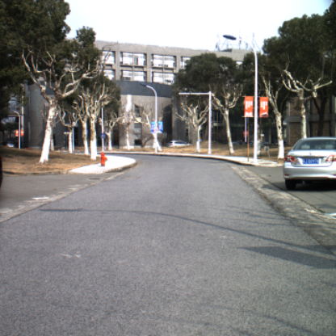
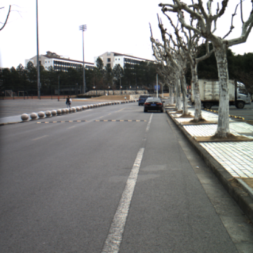
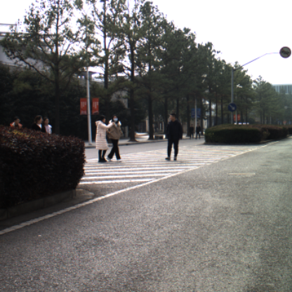
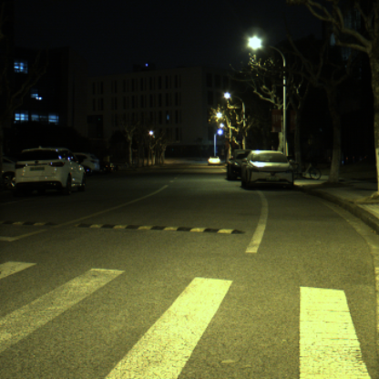
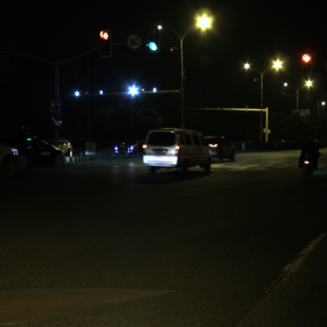
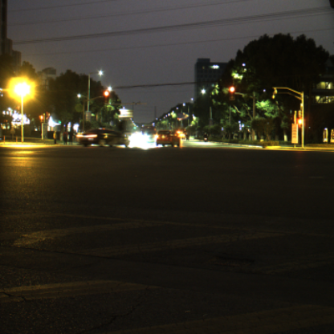
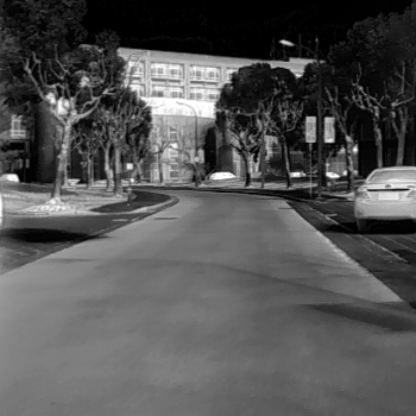
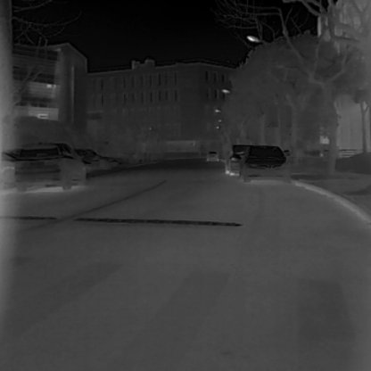
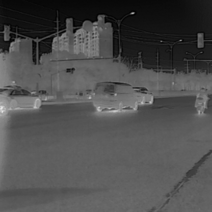
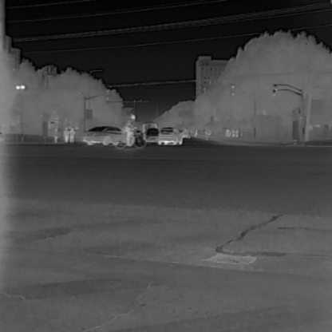

# Generative_Matching
Code and dataset will be released soon.

# Dataset

| Visible |  |  |  |  |  |  |
|:----:| :----:| :----: | :----:| :----: | :----:| :----: |
| Infrared |  | |  | |  | |
