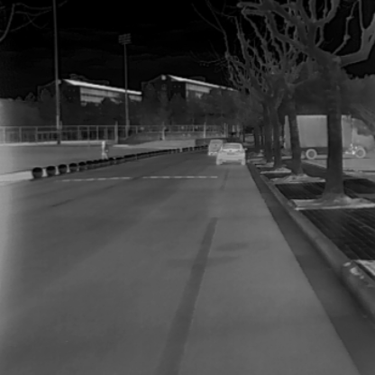

# Generative_Matching
Code and dataset repository for “Generative Model-Based Matching For Infrared and RGB Camera Images”. Will be released after the publishment of our paper.

# Dataset
Our proposed dataset is collected around/inside a university campus under both day and night traffic scenarios, consisting of registrated  Visible-Infrared images pairs.

## Dataset demo

### Visible Images

### Infrared Images

